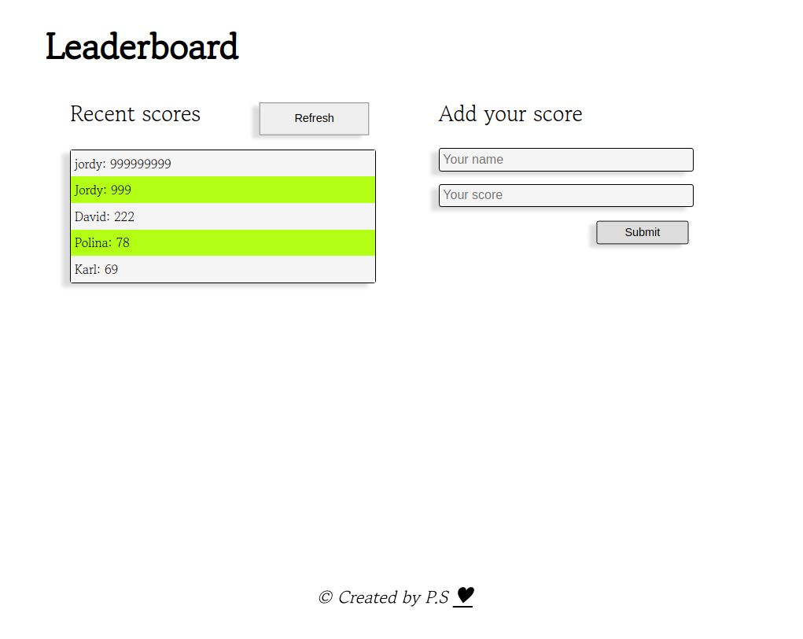

# Leaderboard

> A short project for sending and getting data, using Leaderboard API.

> 

# Description

> Users can submit their score, and the data will be send/store to the API, by the POST method.
> By pressing the "Refresh" button, the stored data is retrieving, by the GET method and the fifth highest scores are displayed on the board.
> The functionality of the project is build with JavaScript and styled with CSS3.
> For sending and retrieving data to/from the API I am using the "axios" library.

## Built With

- JavaScript
- HTML
- CSS

## Getting Started

To get a local copy up and running follow these simple example steps.

## Instructions

To get a local copy up and running follow these simple example steps.

$ cd <folder>

$ git clone git@github.com:PolinaStamenova/leaderboard.git

### Install

- Set up liveserver as an extension in your VS Code.
- If you dont have the live server extension, or are using another software just view directly in your browser.

### Usage

- npm install axios
- npm run start
- Right click and open the dist/index.html in your browser to view.

## Authors

👤 **Polina Stamenova**

- GitHub: [@githubhandle](https://github.com/PolinaStamenova)
- LinkedIn: [LinkedIn](https://www.linkedin.com/in/polina-stamenova-a60766112/)

## 🤝 Contributing

Contributions, issues, and feature requests are welcome!

Feel free to check the [issues page](https://github.com/PolinaStamenova/leaderboard/issues).

## Show your support

Give a ⭐️ if you like this project!

## Acknowledgments

- Microverse
